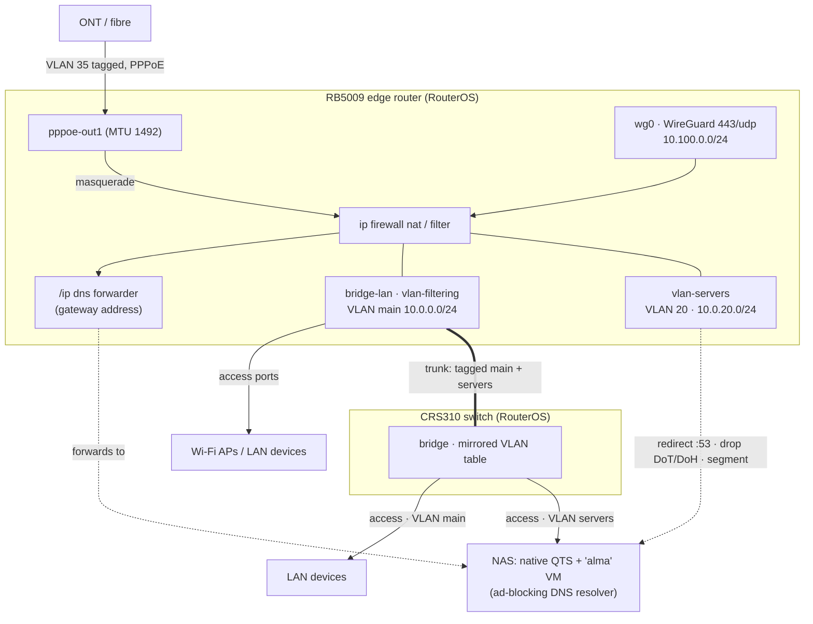

# Ansible Network Layer Template (MikroTik RouterOS)

[](https://github.com/KrzysztofKaletkaDev/ansible-network-template/actions/workflows/lint.yml)

A declarative **Infrastructure as Code (IaC)** template for the network layer of
a home network built on MikroTik RouterOS — a RB5009 edge router and a CRS310
switch, configured entirely over the RouterOS API with `community.routeros`.

It automates a tagged-VLAN PPPoE uplink, a two-VLAN filtered bridge with
`main` / `servers` segmentation, a WireGuard road-warrior server, DHCP and DNS
for both VLANs, and a firewall that intercepts plaintext DNS, blocks DoT/DoH
bypass, and enforces the segment boundary. It is the companion to
[`ansible-homelab-template`](https://github.com/KrzysztofKaletkaDev/ansible-homelab-template)
(the service layer behind this router) — kept in a separate repository on
purpose (see [ADR-0001](docs/adr/0001-separate-repository-for-network-layer.md)).

---

## 🏗 System Architecture



- Plaintext `:53` from the LAN is `redirect`ed to the router's own `/ip dns`,
  which forwards to the ad-blocking resolver; a `tool netwatch` entry swings the
  upstream to public resolvers if that host goes down
  ([ADR-0004](docs/adr/0004-routeros-as-sole-advertised-dns-resolver.md)).
- `main` → `servers` is default-deny with three explicit accepts; `servers` →
  `main` is unrestricted (the NVR dials out to the cameras)
  ([ADR-0006](docs/adr/0006-server-vlan-segmentation.md)).

---

## 🚀 Key Features

- **Declarative over the API.** `community.routeros.api_modify` (`path` + `data`)
  with `connection: local` — no SSH transport for configuration, no connection
  plugin; shared API parameters set once in `module_defaults`
  ([ADR-0002](docs/adr/0002-routeros-api-modules-over-network-cli.md)).
- **Device-class role gating.** One `site.yml`; `routeros_common` runs on every
  device, `routeros_interfaces` / `routeros_dhcp` / `routeros_dns` /
  `routeros_firewall` on the edge router, `routeros_switch` on the CRS310.
- **Bridge VLAN filtering** with a two-VLAN table mirrored between the router and
  the switch, and the tagged trunk added as its own step (never through the
  access-port loops).
- **WireGuard** road-warrior server on `443/udp` with mandatory TCP MSS clamping
  on both the PPPoE and WireGuard interfaces.
- **DNS interception + anti-DoH/DoT.** `redirect` on `:53`, a drop rule for
  known DoH resolvers on `:443`, a drop rule for DoT on `:853` — with the
  ad-blocking resolver exempt.
- **Safe change workflow.** A dead man's switch (config backup + scheduled
  rollback) is pulled into the risky roles; RouterOS Safe Mode is verified to
  cover the parallel API session; the management port is kept out of the bridge
  on the first hardware run.
- **PK-less path convention.** Paths with no primary key in `api_modify`
  (`ip route`, `ip firewall mangle`) are managed with an `ansible:<purpose>`
  comment tag + a paired cleanup task; a path a role fully owns
  (`ip firewall filter`) uses `handle_absent_entries: remove`
  ([ADR-0009](docs/adr/0009-comment-anchored-entries-on-pk-less-paths.md)).
- **CHR test VM.** `docs/bootstrap/chr-test-vm.sh` provisions a four-NIC RouterOS
  CHR instance on libvirt/KVM so roles are rehearsed before hardware
  ([ADR-0005](docs/adr/0005-chr-test-vm-via-shell-script-over-vagrant.md)).
- **Zero secret leakage.** `.gitignore` enforces `.example`-only templates;
  real addresses, MACs, keys and PPPoE credentials never leave the ignored local
  files.

---

## 📂 Repository Layout

```text
.
├── ansible.cfg                    # connection: local, no privilege escalation
├── site.yml                       # one play; roles gated by routeros_device_class
├── .github/workflows/lint.yml     # CI: ansible-lint, yamllint, --syntax-check
├── .pre-commit-config.yaml        # local hooks (ansible-lint + yamllint)
├── .ansible-lint  .yamllint
├── requirements-dev.txt
├── collections/requirements.yml   # community.routeros >= 3.0.0
├── inventory/
│   └── hosts.yml.example          # routers > edge / switches / test
├── group_vars/
│   ├── all/vars.yml.example       # non-secret variables (grows per role)
│   ├── routers/vault.yml.example  # edge router secrets (Ansible Vault)
│   ├── edge/vars.yml.example      # routeros_device_class: edge
│   ├── switches/vars.yml.example  # routeros_device_class: switch + CRS310 ports
│   ├── switches/vault.yml.example # switch secrets — a different password
│   └── test/{vars,vault}.yml.example
├── docs/
│   ├── adr/                       # Architecture Decision Records (0001–0009)
│   └── bootstrap/                 # chr-test-vm.sh + the one-time hardware bootstrap
└── roles/
    ├── routeros_common/           # identity, time, account, service hardening
    ├── routeros_interfaces/       # bridge + VLAN table, PPPoE, WireGuard, MSS clamp
    ├── routeros_switch/           # CRS310: mirrored VLAN table, access ports, trunk
    ├── routeros_dhcp/             # pool / server / network + reservations, both VLANs
    ├── routeros_dns/              # /ip dns forwarder + static records + Netwatch fallback
    └── routeros_firewall/         # address lists, NAT, the complete filter table
```

---

## 🛠 Deployment & Usage

### 1. Prerequisites

- **Control node:** Linux workstation with `ansible-core` (2.15+) and
  `librouteros` (`pip install librouteros --break-system-packages`).
- **Collection:** `ansible-galaxy collection install -r collections/requirements.yml`
  (the system `community.routeros` is usually too old — 3.0.0+ is required).
- **Test environment (recommended):** a libvirt/KVM host. `docs/bootstrap/chr-test-vm.sh`
  builds a disposable RouterOS CHR VM and runs `site.yml --limit test` against
  it before anything touches real hardware.

### 2. Parameterization

```bash
git clone https://github.com/KrzysztofKaletkaDev/ansible-network-template.git
cd ansible-network-template

cp inventory/hosts.yml.example inventory/hosts.yml
cp group_vars/all/vars.yml.example group_vars/all/vars.yml
cp group_vars/routers/vault.yml.example group_vars/routers/vault.yml
cp group_vars/edge/vars.yml.example group_vars/edge/vars.yml
cp group_vars/switches/vars.yml.example group_vars/switches/vars.yml
cp group_vars/switches/vault.yml.example group_vars/switches/vault.yml
```

Fill in the real addresses in `inventory/hosts.yml`, the real subnets / ports /
reservation tables in `group_vars/all/vars.yml`, then encrypt the vaults:

```bash
ansible-vault encrypt group_vars/routers/vault.yml
ansible-vault encrypt group_vars/switches/vault.yml
```

### 3. One-time bootstrap (outside Ansible)

Before the first `site.yml` run, each device needs, by hand (WinBox / WebFig —
this is the only click-configuration the design allows):

- the management account (`routeros_api_user`), `group=full`;
- its SSH public key imported (`/user ssh-keys import` — file-based, not
  possible over the API);
- the `api` service enabled.

The **CRS310 is bootstrapped with a cable straight to a laptop**, not over the
trunk — VLAN 1 is tagged there, so a factory switch is unreachable through it.
See `docs/bootstrap/README.md`.

### 4. Rehearse on CHR, then deploy

```bash
# CHR (routeros_device_class set locally in group_vars/test/vars.yml)
ansible-playbook -i inventory/hosts.yml site.yml --limit test --check --diff
ansible-playbook -i inventory/hosts.yml site.yml --limit test --diff
ansible-playbook -i inventory/hosts.yml site.yml --limit test --diff   # changed=0

# hardware — see "First hardware run" below
ansible-playbook -i inventory/hosts.yml site.yml --limit edge --ask-vault-pass
ansible-playbook -i inventory/hosts.yml site.yml --limit switches --ask-vault-pass
```

**First hardware run.** `routeros_interfaces` and `routeros_firewall` can cut the
path to the router, on hardware with no serial console. Every such run goes
through: the **dead man's switch** (mechanism A, on by default — disarm with
`--tags clear-rollback` after a confirmed run), a live **Safe Mode** session
alongside (mechanism B), and the **management port kept out of
`routeros_lan_bridge_ports`** until connectivity via the bridge address is
confirmed (mechanism C). `routeros_interfaces` on the RB5009 must be applied
before the CRS310's management address is routable at all. See `CLAUDE.md`.

### 5. Continuous Integration

Every push and pull request runs the
[Lint workflow](.github/workflows/lint.yml): `ansible-lint`, `yamllint`, and an
`ansible-playbook --syntax-check` against `site.yml` with the `.example`
templates copied into place. There is no Molecule / VM job — RouterOS does not
run in a plain container and CHR needs KVM, which GitHub-hosted runners do not
provide; CHR rehearsal is a local, manual gate.

---

## 🔒 Security Principles Applied

- **Zero secret leakage.** `.gitignore` keeps `inventory/hosts.yml`,
  `group_vars/**/*.yml` and every `vault.yml` out of version control; only
  `.example` templates with placeholder values are committed.
- **Separate credentials per device.** The CRS310 has its own API password
  (`group_vars/switches/vault.yml`), distinct from the router's — a compromise
  of one device does not hand over the other.
- **Plain API on the LAN, deliberately.** `tls: false` (port 8728): no
  certificate is provisioned, the API service is pinned to the control node's
  address, and the LAN is treated as the trust boundary
  ([ADR-0002](docs/adr/0002-routeros-api-modules-over-network-cli.md)). Flip
  `tls` back on and assign a certificate before running across any untrusted
  segment.
- **Anti-bypass DNS.** Plaintext `:53` is redirected to the local resolver and
  DoT/DoH to public resolvers is dropped, so a device with a hardcoded external
  resolver still gets ad-blocked
  ([ADR-0004](docs/adr/0004-routeros-as-sole-advertised-dns-resolver.md)).
- **Segmentation with a stated asymmetry.** `main` → `servers` is default-deny;
  `servers` → `main` is open, and
  [ADR-0006](docs/adr/0006-server-vlan-segmentation.md) says why and what it
  costs, rather than hiding it behind a brittle allow-list.

---

## 👨‍💻 Author

**Krzysztof** — Systems Administrator / Infrastructure Engineer

Focusing on Linux Systems Administration, Cloud Architectures, and
Infrastructure Automation.
